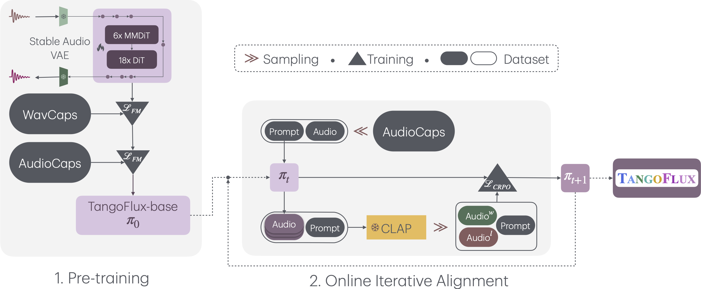

<h1 align="center">✨ 
<br/>  
TangoFlux: Super Fast and Faithful Text to Audio Generation with Flow Matching and Clap-Ranked Preference Optimization 
<br/>
✨✨✨


</h1>

<div align="center">
  

<br/>

[](https://arxiv.org/abs/2412.21037) [](https://huggingface.co/declare-lab/TangoFlux) [](https://tangoflux.github.io/) [](https://huggingface.co/spaces/declare-lab/TangoFlux) [](https://huggingface.co/datasets/declare-lab/CRPO)


</div>

## Quickstart on Google Colab

| Colab |
| --- |
[](https://colab.research.google.com/drive/1j__4fl_BlaVS_225M34d-EKxsVDJPRiR?usp=sharing) 

## Overall Pipeline
TangoFlux consists of FluxTransformer blocks, which are Diffusion Transformers (DiT) and Multimodal Diffusion Transformers (MMDiT) conditioned on a textual prompt and a duration embedding to generate a 44.1kHz audio up to 30 seconds long. TangoFlux learns a rectified flow trajectory to an audio latent representation encoded by a variational autoencoder (VAE). TangoFlux training pipeline consists of three stages: pre-training, fine-tuning, and preference optimization with CRPO. CRPO, particularly, iteratively generates new synthetic data and constructs preference pairs for preference optimization using DPO loss for flow matching.




🚀 **TangoFlux can generate up to 30 seconds long 44.1kHz stereo audios in about 3 seconds.**

## Training TangoFlux
We use the accelerate package from HuggingFace for multi-gpu training. Run accelerate config from terminal and set up your run configuration by the answering the questions asked. We have placed the default accelerator config in the `configs` folder. 

`tangoflux_config` defines the training and model hyperparameters:
```bash
CUDA_VISISBLE_DEVICES=0,1 accelerate launch --config_file='configs/accelerator_config.yaml' src/train.py   --checkpointing_steps="best" --save_every=5 --config='configs/tangoflux_config.yaml'
```
## Inference with TangoFlux
Download the TangoFlux model and generate audio from a text prompt.
TangoFlux can generate audios up to 30 second long through passing in a duration variable in the `model.generate` function.
```python
import torchaudio
from tangoflux import TangoFluxInference
from IPython.display import Audio

model = TangoFluxInference(name='declare-lab/TangoFlux')
audio = model.generate('Hammer slowly hitting the wooden table', steps=50, duration=10)

Audio(data=audio, rate=44100)
```
Our evaluation shows that inferring with 50 steps yield the best results. A CFG scale of 3.5, 4, and 4.5 yield simliar quality output.
For faster inference, consider setting steps to 25 that yield similar audio quality.

## Evaluation Scripts

## TangoFlux vs. Other Audio Generation Models

This key comparison metrics include:

- **Output Length**: Represents the duration of the generated audio.
- **FD**<sub>openl3</sub>: Fréchet Distance.
- **KL**<sub>passt</sub>: KL divergence.
- **CLAP**<sub>score</sub>: Alignment score.


All the inference times are observed on the same A40 GPU. The counts of trainable parameters are reported in the **\#Params** column.

| Model                           | \#Params  | Duration | Steps | FD<sub>openl3</sub> ↓ | KL<sub>passt</sub> ↓ | CLAP<sub>score</sub> ↑ | IS ↑ | Inference Time (s) |
|---------------------------------|-----------|----------|-------|-----------------------|----------------------|------------------------|------|--------------------|
| **AudioLDM 2-large**            | 712M      | 10 sec   | 200   | 108.3                | 1.81                 | 0.419                  | 7.9  | 24.8               |
| **Stable Audio Open**           | 1056M     | 47 sec   | 100   | 89.2                 | 2.58                 | 0.291                  | 9.9  | 8.6                |
| **Tango 2**                     | 866M      | 10 sec   | 200   | 108.4                | **1.11**             | 0.447                  | 9.0  | 22.8               |
| **TangoFlux-base**              | **515M**  | 30 sec   | 50    | 80.2                 | 1.22                 | 0.431                  | 11.7 | **3.7**            |
| **TangoFlux**                   | **515M**  | 30 sec   | 50    | **75.1**             | 1.15                 | **0.480**              | **12.2** | **3.7**         |


## Citation

```bibtex

@article{Hung2025TangoFlux,
  title = {TangoFlux: Super Fast and Faithful Text to Audio Generation with Flow Matching and Clap-Ranked Preference Optimization},
  author = {Chia-Yu Hung and Navonil Majumder and Zhifeng Kong and Ambuj Mehrish and Rafael Valle and Bryan Catanzaro and Soujanya Poria},
  year = {2025},
  url = {https://openreview.net/attachment?id=tpJPlFTyxd&name=pdf},
  note = {Available at OpenReview}
}

```
